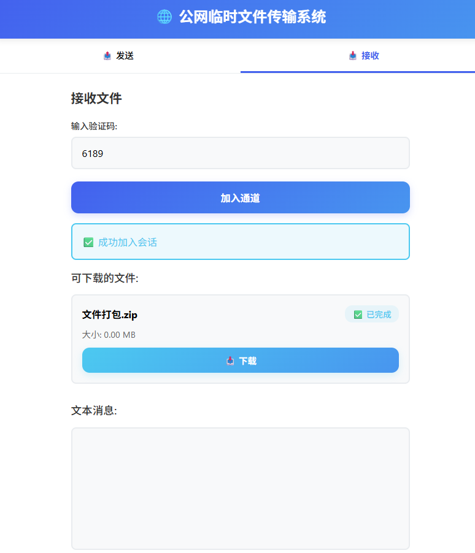

# 公网临时文件传输系统

一个安全、高效、易用的临时文件传输工具，支持公网环境下的文件和文本传输，无需登录，一键分享。

## 🚀 核心特性

- **无需登录**：无需注册账号，即开即用
- **公网传输**：支持不同网络环境间的文件传输
- **大文件支持**：单个文件最大支持300MB
- **文本传输**：支持直接发送文本消息
- **安全可靠**：会话自动过期，保护数据安全
- **实时反馈**：上传/下载进度实时显示
- **跨设备兼容**：支持电脑端和移动端

## 📸 界面预览

### 发送界面


### 接收界面


## 🛠️ 快速开始

### 环境要求
- Python 3.7+
- 依赖包：`pip install -r requirements.txt`

### 启动服务
```bash
python main.py
```

服务默认运行在 `http://localhost:8000`

## 🐳 Docker部署

### 环境要求
- Docker

### 构建镜像
```bash
docker build -t sync_online:1.0 .
```

### 运行容器
```bash
docker run -d -p 8000:8000 --name sync_online sync_online:1.0
```

### 访问服务
服务将运行在 `http://localhost:8000`

## 📁 项目结构

```
sync_online/
├── static/          # 静态文件
│   ├── index.html   # 前端页面
│   ├── styles.css   # 样式文件
│   ├── app.js       # 前端逻辑
│   └── picture/     # 界面截图
├── main.py          # 主服务
├── session_manager.py # 会话管理
├── file_manager.py  # 文件管理
├── websocket_manager.py # WebSocket管理
├── models.py        # 数据模型
├── config.py        # 配置文件
└── requirements.txt # 依赖包
```

## 📖 使用指南

### 发送文件
1. 打开应用，选择「发送」模式
2. 点击「创建传输通道」按钮
3. 系统会生成一个4位验证码
4. 选择要上传的文件
5. 等待上传完成
6. 将验证码分享给接收方

### 接收文件
1. 打开应用，选择「接收」模式
2. 输入接收方提供的4位验证码
3. 点击「加入通道」按钮
4. 查看可下载的文件列表
5. 点击「下载」按钮获取文件

### 发送文本
1. 在发送模式下，找到「发送文本消息」区域
2. 输入要发送的文本内容
3. 点击「发送文本」按钮
4. 接收方会实时收到文本消息

## 🔒 安全特性

- **会话过期**：每个会话自动设置过期时间
- **临时存储**：文件仅在会话期间保存
- **验证码验证**：确保只有知道验证码的用户才能接收文件
- **HTTPS支持**：可配置使用HTTPS协议

## 🎨 界面设计

- **现代化UI**：采用渐变色彩和卡片式设计
- **响应式布局**：适配不同屏幕尺寸
- **流畅动画**：添加平滑的过渡效果
- **直观操作**：简化用户操作流程

## 📝 技术栈

- **后端**：Python, FastAPI, WebSocket
- **前端**：HTML5, CSS3, JavaScript
- **存储**：本地临时文件系统

## 🌟 特色功能

- **一键复制**：点击验证码或文本消息即可自动复制
- **实时通知**：通过WebSocket实现实时消息推送
- **进度显示**：文件上传/下载进度实时展示
- **多文件支持**：一次可选择多个文件上传

## 🤝 贡献

欢迎提交Issue和Pull Request，一起改进这个项目！

## 📄 许可证

MIT License

---

**享受安全、便捷的文件传输体验！** 🎉